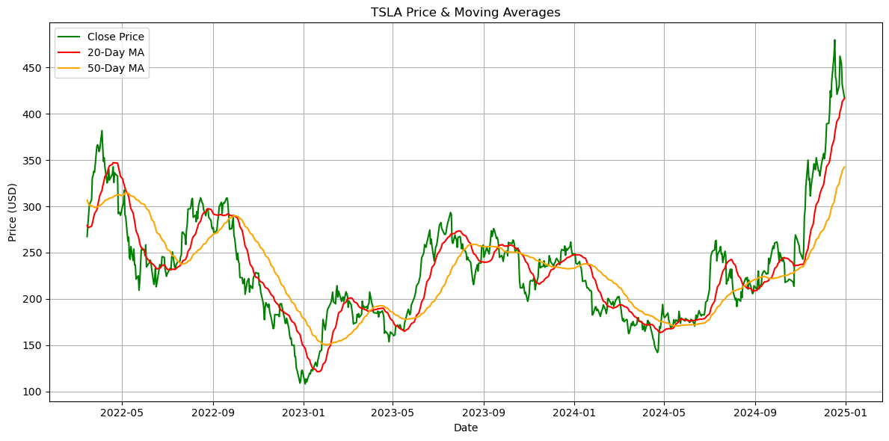
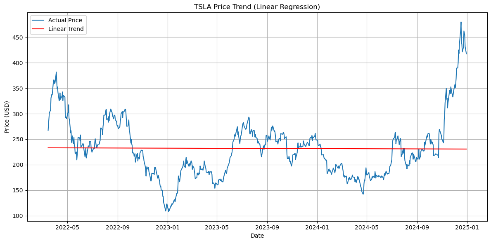

```python
""" Tesla Moving-Average Analysis (robust version) Author: Mutaz Bellah

This script downloads daily Tesla (TSLA) prices, calculates 20/50‑day moving averages, detects Golden/Death Cross events, fits a linear‑regression trend line, and saves three charts in ./charts/. """

from pathlib import Path 
from typing import Tuple

import numpy as np
import pandas as pd 
import yfinance as yf
import matplotlib.pyplot as plt 
from sklearn.linear_model import LinearRegression

##-----------------------------------------------------------------------------
##Data Utilities
##-----------------------------------------------------------------------------
def download_data(start: str = "2022-01-01", end: str = "2024-12-31") -> pd.DataFrame: 
    """Download TSLA data with stable columns (keeps 'Close').""" 
    df = yf.download(
        "TSLA", 
        start=start,
        end=end,
        auto_adjust=False, # keep raw OHLCV columns
        progress=False, 
        actions=False, )

    # yfinance>=0.2 may return MultiIndex cols even for single ticker
    if isinstance(df.columns, pd.MultiIndex):
        df.columns = df.columns.get_level_values(0)

    # Ensure a 'Close' column exists (fallback to 'Adj Close')
    if "Close" not in df.columns and "Adj Close" in df.columns:
        df.rename(columns={"Adj Close": "Close"}, inplace=True)
    return df
    
def add_moving_averages(
    df: pd.DataFrame, short: int = 20, long: int = 50
) -> pd.DataFrame: 
    """Append SMA columns and drop initial NaNs.""" 
    df = df.copy()
    df[f"MA{short}"] = df["Close"].rolling(window=short).mean()
    df[f"MA{long}"] = df["Close"].rolling(window=long).mean()
    return df.dropna(subset=[f"MA{short}", f"MA{long}"])

#-----------------------------------------------------------------------------
#Plotting helpers
#-----------------------------------------------------------------------------
def _ensure_chart_dir() -> Path:
    out = Path("charts") 
    out.mkdir(exist_ok=True)
    return out

def plot_price_ma(df: pd.DataFrame, short: int, long: int) -> None:
    _ensure_chart_dir()
    plt.figure(figsize=(12, 6))
    plt.plot(df["Close"], label="Close Price", color="green")
    plt.plot(df[f"MA{short}"], label=f"{short}-Day MA", color="red") 
    plt.plot(df[f"MA{long}"], label=f"{long}-Day MA", color="orange")
    plt.title("TSLA Price & Moving Averages") 
    plt.xlabel("Date") 
    plt.ylabel("Price (USD)") 
    plt.legend() 
    plt.grid(True) 
    plt.tight_layout() 
    plt.savefig("charts/tsla_ma_plot.png", dpi=300) 
    plt.show()

def plot_regression(df: pd.DataFrame) -> None: 
    _ensure_chart_dir()
    X = np.arange(len(df)).reshape(-1,1) 
    y = df["Close"].values.reshape(-1, 1) 
    model = LinearRegression().fit(X, y) 
    trend = model.predict(X)
    plt.figure(figsize=(12,6))
    plt.plot(df["Close"], label="Actual Price")
    plt.plot(df.index, trend, label="Linear Trend", color="red")
    plt.title("TSLA Price Trend (Linear Regression)")
    plt.xlabel("Date")
    plt.ylabel("Price (USD)")
    plt.legend()
    plt.grid(True)
    plt.tight_layout()
    plt.savefig("charts/tsla_trend.png", dpi=300)
    plt.show()
def plot_crossovers(df: pd.DataFrame, short: int, long: int) -> None:
    _ensure_chart_dir()
    cross_up = (df[f"MA{short}"] > df[f"MA{long}"]) & (
        df[f"MA{short}"].shift(1) <= df[f"MA{long}"].shift(1) 
    )
    cross_dn = (df[f"MA{short}"] < df[f"MA{long}"]) & ( 
        df[f"MA{short}"].shift(1) >= df[f"MA{long}"].shift(1) 
    )
    plt.figure(figsize=(12, 6))
    plt.plot(df["Close"], label="Close Price")
    plt.plot(df[f"MA{short}"], label=f"{short}-Day MA")
    plt.plot(df[f"MA{long}"], label=f"{long}-Day MA")
    plt.scatter(df.index[cross_up], df["Close"][cross_up], marker="^", s=90, color="green", label="Golden Cross")
    plt.scatter(df.index[cross_dn], df["Close"][cross_dn], marker="v", s=90, color="red", label="Death Cross")
    plt.title("TSLA – Moving Average Crossovers")
    plt.xlabel("Date")
    plt.ylabel("Price (USD)")
    plt.legend()
    plt.grid(True)
    plt.tight_layout()
    plt.savefig("charts/tsla_crossover.png", dpi=300)
    plt.show()
#-----------------------------------------------------------------------------
#Main driver
#-----------------------------------------------------------------------------
def main(short: int = 20, long: int = 50) -> Tuple[pd.DataFrame, None]: 
    df = download_data()
    df = add_moving_averages(df, short, long)
    plot_price_ma(df, short, long) 
    plot_regression(df) 
    plot_crossovers(df, short, long) 
    return df

if __name__ == "__main__":
    main()


```


    

    


    

    


    

    


```python

```
